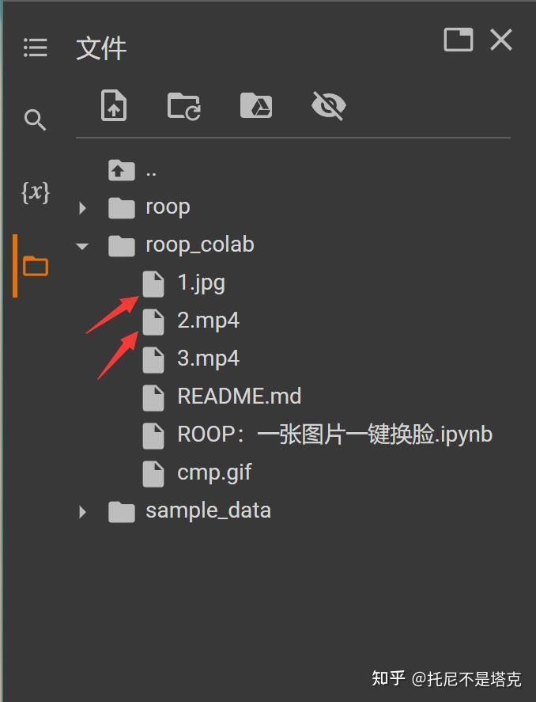
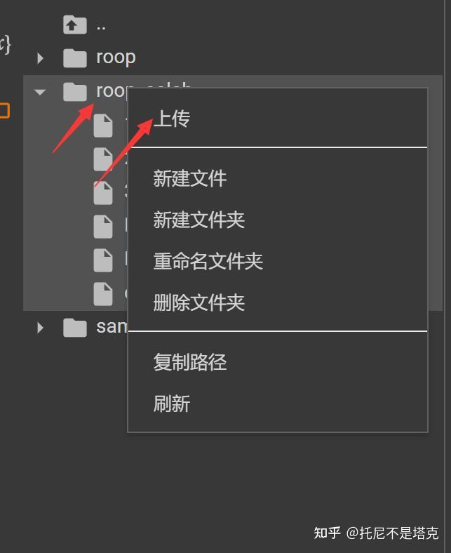
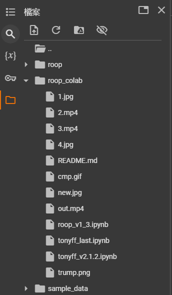

# 使用Google Colaboratory跑深度學習 
南華大學 跨領域-人工智慧期中報告  
11024201 趙青益  
11024114 翁莊堡 

AI領域人才輩出，突然就跳出一個大佬“s0md3v”，開源了一個單圖就可以進行視頻換臉的專案。 
 

專案首頁給了一張換臉動圖非常有說服力，真是一圖勝萬言。 
  

快速在本地配置一個環境，​​驗證了一下，確實還不錯。主要是，簡單，快速，簡單，快速，簡單，快速！ 

只是本地配置要下一堆東西，配一堆東西，對一般人來說可能還是有一點壓力，動手能力強一點的估計也得折騰一陣子。 

為了節省大家的時間和腦細胞。我已經快速編寫了另一個基於谷歌Colabd的腳本。有需要的直接可以拿去用！ 

只要魔法加持，無需本地配置，無需高配電腦，點點滑鼠即可完成。 

以下簡單介紹一下使用方法~~  

首先，打開這個位址：  
<https://github.com/dream80/roop_colab>  
然後點選紅色圈中的ipynb檔! 
 
然後點選“Open in Colab ” 
 
進入谷歌Colab平台之後，依序點選腳本。就可以完成整個換臉流程了。滑鼠移到「括號」就會出現一個可以點選的「播放」按鈕。 
 
也可以在頂部選單中找到“代碼執行程序”-> “全部運行” ，這樣就可以一鍵運行了！ 

 
 
 
 
 

為了讓大家快速切無異常的體驗到單圖換臉的樂趣，我已經準備好了示範的圖片和影片素材。 
  
運行完①之後，可以在左邊的文件管理裡面查看。如果你想替換圖片和視頻，只要把這兩個文件換掉。替換之後，重新點擊⑤就好了。 

檔案不是很大的話，可以直接右鍵點擊roop_colab資料夾，點擊上傳，找到電腦上的影片檔案上傳就可以了。 
  
上傳成功之後，把原來的1.jpg和2.MP4刪除，把你自己上傳的照片和影片改成這兩個名字，然後運行第⑤步就可以了。 

第⑤運行完成之後，會產生一個叫out.mp4的影片文件，這個就是換臉後的文件了。  
   
在左側的檔案管理器中，右鍵，下載就可以了。下載到本機就直接可以查看效果咯。 \
### 我們使用的圖片為:

### 原影像:

 

### 換臉結果:

